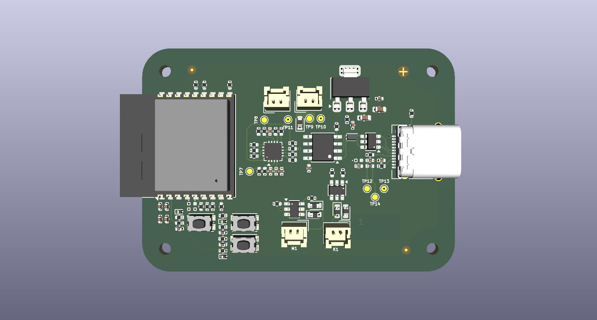

# IoT Measurement Endpoint

A KiCad PCB design for a wireless IoT node that reads analog sensors and drives actuators (DC motor and solenoid valve). Built around the ESP32-C3 module for WiFi/BLE connectivity.



## Features

- **ESP32-C3-WROOM-02** — WiFi 4 + Bluetooth LE microcontroller module
- **Analog sensor front-end** — LM324 quad op-amp for signal conditioning
- **Actuator outputs** — DMC2053UVT complementary MOSFET pair for a DC motor and a solenoid valve
- **USB-C** — CH330N USB-to-UART bridge for programming and serial debug; TVS + common-mode choke for ESD/EMI protection
- **Power** — battery connector with 5V USB-C input; NCP1117-3.3 LDO generates the 3.3V rail; polyfuse (0402L050SL) for overcurrent protection
- **User interface** — tactile push buttons (KMR232NG) and status LEDs
- **Fabrication aids** — fiducials, mounting holes, and test points throughout

## Schematic sheets

| Sheet | Contents |
|---|---|
| Top-level | Sheet hierarchy and inter-sheet connections |
| Microcontroller | ESP32-C3-WROOM-02 and decoupling |
| Sensor | LM324 op-amp conditioning circuit |
| Motor | DC motor MOSFET driver with flyback diode |
| Valve | Solenoid valve MOSFET driver |
| 3.3V Regulator | NCP1117-3.3 LDO and bulk capacitors |
| USB Connector | USB-C, CH330N, common-mode choke, TVS array |
| Battery Connector | Battery input and protection diodes |
| Buttons | Tactile switch debounce network |
| LEDs | Status indicators |

## Power architecture

```
USB-C (5V) ──┬── CH330N (serial) ──► UART ──► ESP32-C3
             │
Battery ─────┴── NCP1117-3.3 ──► 3.3V rail ──► ESP32-C3, LM324, logic
                                               └── actuator gate drives

Actuators driven from +6V / +5V rail (motor, valve)
```

## Key components

| Reference | Part | Description |
|---|---|---|
| U (MCU) | ESP32-C3-WROOM-02 | WiFi 4 / BLE 5 module |
| U (USB) | CH330N | USB-to-UART converter, SOIC-8 |
| U (reg) | NCP1117-3.3 | 1A LDO, SOT-223 |
| U (amp) | LM324 | Quad op-amp, DIP-14/SOIC-14 |
| Q | DMC2053UVT | Complementary P+N MOSFET pair, TSOT-23-6 |
| D (ESD) | ESD9B5.0ST5G | TVS diode, signal lines |
| D (USB TVS) | WE-TVS-82400102 | Low-cap TVS array, SOT-23-6 |
| L (USB filter) | 0603USB-142 | Common-mode choke, 98nH, 500mA |
| F | 0402L050SL | Resettable polyfuse |
| SW | KMR232NG ULC LFS | Tactile push button |

## Tools

- **EDA**: KiCad 10.0
- **Simulation**: ngspice (`.cir` files in repo for op-amp circuit verification)
- **3D export**: STEP / STL / GLB (see `iot-measurement-endpoint.step`)
